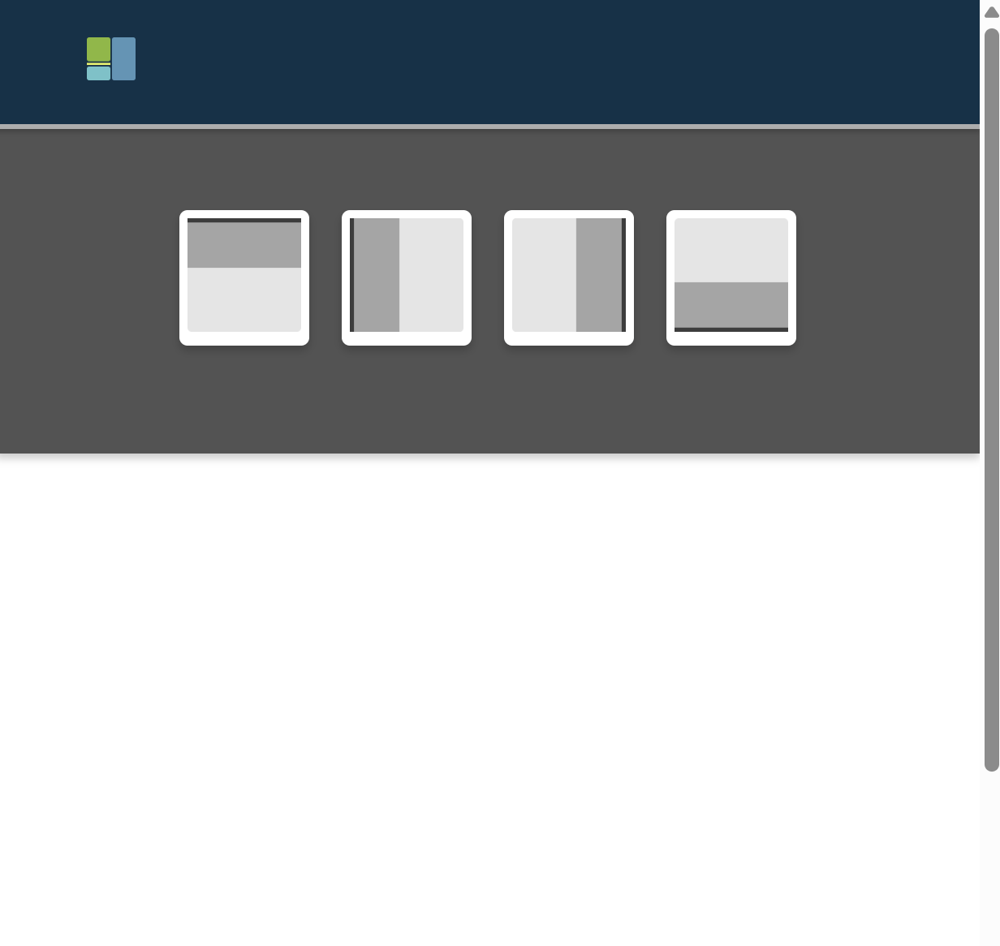
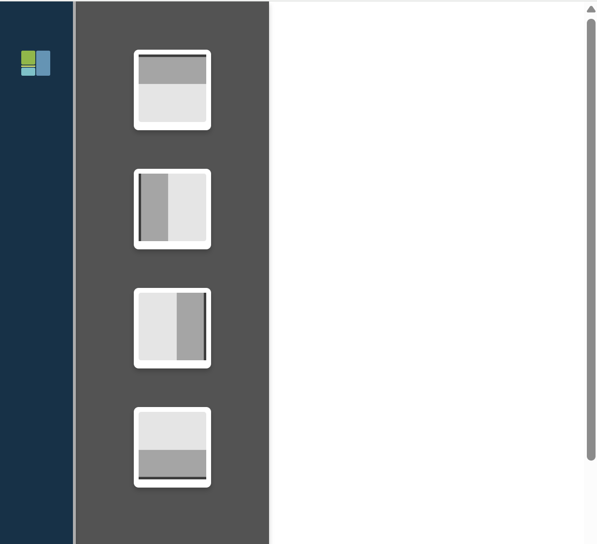
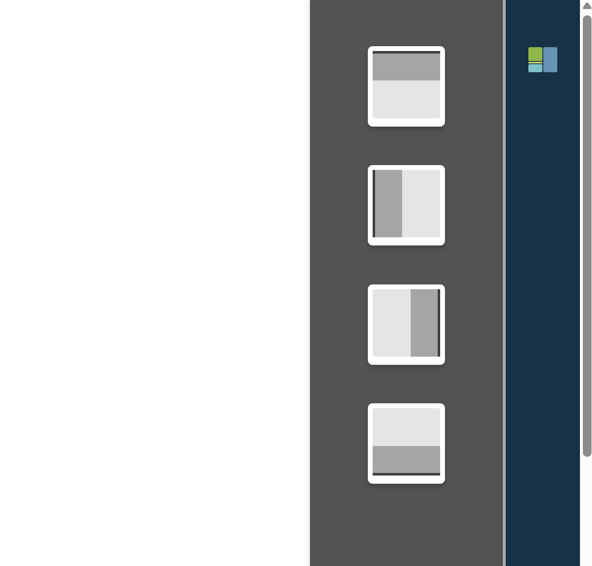
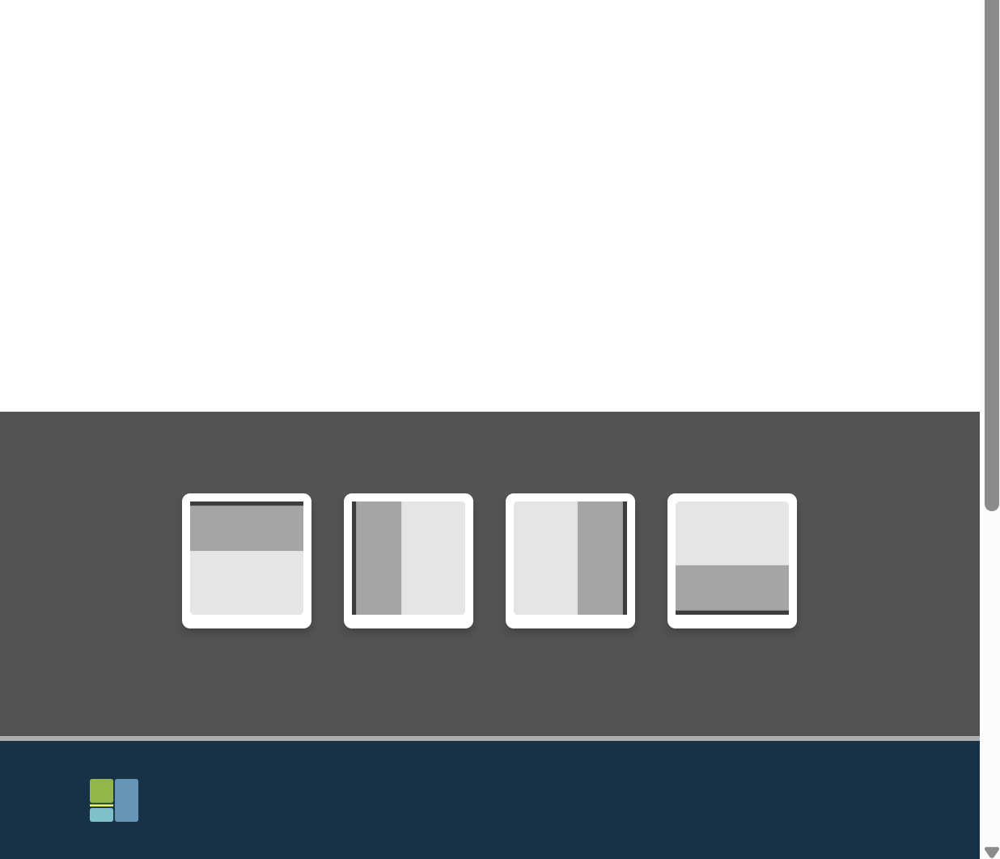

# Dynamic Navigation Drawer

Exploring navigation bar styles and giving users autonomy over their page layout.  
Simple React + SCSS setup, focusing on dynamic programming, SCSS mixins, and flexible UI layouts.

---

## Features

- Dynamic navigation bar placement: top, bottom, left, right
- Interactive layout preview panel
- Smooth animations for opening/closing previews
- Fully built with React and SCSS
- SCSS maps and mixins for concise, maintainable code

---

## Preview

|  |  |  |  |

